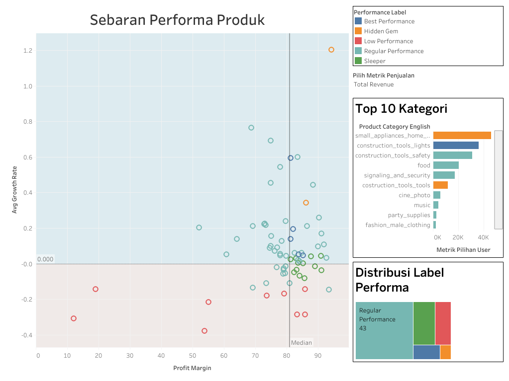

# 📊 Analisis Performa Produk E-Commerce (Olist) — Januari–Agustus 2018

End-to-end data analysis project: **SQL → CSV → Tableau Dashboard**, menggunakan dataset publik [Olist Brazilian E-Commerce](https://www.kaggle.com/datasets/olistbr/brazilian-ecommerce).

🔗 **Dashboard interaktif:** [Tableau Public — Dashboard Performa Produk](https://public.tableau.com/app/profile/doni.ramadhani/viz/dashboardPerformaProduk/Dashboard2?publish=yes)



---

## 🌟 Laporan STARS

### 🔹 Situation (Situasi)

Sebuah perusahaan e-commerce (Olist) memiliki ratusan kategori produk yang terjual sepanjang 2018, namun belum memiliki cara sistematis untuk membedakan **kategori mana yang layak diprioritaskan, dipertahankan, atau dievaluasi ulang**. Data transaksi mentah tersebar di banyak tabel (orders, order items, products, reviews) sehingga sulit dibaca langsung oleh tim bisnis untuk pengambilan keputusan.

### 🔹 Task (Tugas)

Membangun sebuah alur analisis end-to-end yang mampu:
1. Mengubah data transaksi mentah menjadi ringkasan performa per kategori produk (volume penjualan, revenue, profit margin, tren pertumbuhan, dan kepuasan pelanggan).
2. Mengklasifikasikan setiap kategori produk ke dalam **label performa** yang mudah dipahami oleh stakeholder non-teknis.
3. Menyajikan hasilnya dalam dashboard visual yang interaktif dan bisa dieksplorasi.

### 🔹 Action (Tindakan)

**1. Data Extraction & Transformation (SQL)** — [`sql/create_table_performa_produk_2018.sql`](sql/create_table_performa_produk_2018.sql)
- Menggabungkan tabel `olist_orders`, `olist_order_items`, `olist_products`, `olist_product_category_name_translation`, dan `olist_order_reviews` (dengan subquery agregasi untuk menghindari duplikasi akibat relasi review one-to-many).
- Menghitung volume penjualan bulanan (Jan–Agu 2018), total revenue, freight cost, net profit, dan profit margin per kategori produk.
- Menghitung **rata-rata growth rate** bulanan (month-over-month) sebagai indikator tren.
- Mengintegrasikan **rata-rata skor ulasan pelanggan** per kategori.
- Membagi setiap metrik (volume, margin, growth, review) ke dalam **kuartil (NTILE 4)** agar penilaian bersifat relatif dan objektif terhadap seluruh kategori, bukan angka absolut yang bias.
- Menyusun logika klasifikasi berbasis kombinasi kuartil menjadi 5 label performa:

| Label | Logika |
|---|---|
| 🏆 **Best Performance** | Volume, margin, growth, dan review sama-sama tinggi (kuartil atas) |
| 💎 **Hidden Gem** | Margin & review sangat tinggi, growth kuat, tapi volume masih rendah–sedang |
| 😴 **Sleeper** | Volume & margin tinggi, tapi growth melambat/menurun |
| ⚠️ **Low Performance** | Volume rendah dan growth negatif |
| ⏺️ **Regular Performance** | Tidak masuk kategori ekstrem manapun |

**2. Data Output** — [`data/performa_produk_2018.csv`](data/performa_produk_2018.csv)
Hasil query diekspor menjadi tabel ringkas berisi 71 kategori produk beserta seluruh metrik dan label performanya.

**3. Visualisasi** — Tableau Public
- Scatter plot **Profit Margin vs Avg Growth Rate**, dengan garis median sebagai pembatas kuadran dan warna berdasarkan label performa.
- Bar chart **Top 10 Kategori** berdasarkan metrik penjualan yang dipilih user (parameter interaktif).
- Distribusi jumlah kategori per label performa.

### 🔹 Result (Hasil)

Dari 71 kategori produk yang dianalisis (periode Jan–Agu 2018), dashboard berhasil memetakan:

| Label | Jumlah Kategori | Karakteristik |
|---|---|---|
| 🏆 Best Performance | 5 | Volume & profit tinggi, terus tumbuh, rating pelanggan bagus |
| 💎 Hidden Gem | 2 | Margin sangat tebal & tumbuh pesat, tapi volumenya masih kecil |
| 😴 Sleeper | 12 | Penjualan besar & margin sehat, tapi mulai stagnan/menurun |
| ⚠️ Low Performance | 9 | Volume kecil & tren terus menurun |
| ⏺️ Regular Performance | 43 | Performa moderat, tidak menonjol ke satu arah |

Dashboard ini memungkinkan tim bisnis menjawab pertanyaan seperti *"kategori mana yang harus digenjot marketing-nya?"* atau *"kategori mana yang boros ongkos kirim tapi marginnya tipis?"* hanya dalam hitungan detik, tanpa perlu menulis query SQL sendiri.

---

## 🍯 Rekomendasi Strategis per Label Performa

Angka tanpa aksi hanyalah angka. Berikut rekomendasi bisnis untuk masing-masing kelompok performa:

**🏆 Best Performance — *"Jaga dan Perbesar"***
Kategori seperti `health_beauty` (5.841 unit terjual, margin 85,3%, tumbuh 4,7%/bulan) dan `auto` adalah tulang punggung profit saat ini. Rekomendasi: pastikan stok tidak pernah kosong, prioritaskan slot iklan/homepage, dan jadikan bundling produk lain di sekitar kategori ini untuk menaikkan average order value.

**💎 Hidden Gem — *"Investasi Kecil, Potensi Besar"***
`small_appliances_home_oven_and_coffee` tumbuh 120% per bulan dengan margin 94% dan rating 4,5 — tapi baru terjual 70 unit. Ini bukan produk yang salah, tapi produk yang **belum ditemukan pasar**. Rekomendasi: tingkatkan budget iklan dan visibilitas pencarian secara agresif, karena setiap tambahan unit terjual hampir seluruhnya menjadi profit bersih.

**😴 Sleeper — *"Bangunkan Sebelum Tertidur Lelap"***
`watches_gifts` dan `sports_leisure` masih menyumbang revenue besar dengan margin sehat, namun growth-nya sudah negatif. Rekomendasi: lakukan refresh strategi — promo re-engagement, evaluasi harga kompetitor, atau segarkan varian produk — sebelum kategori ini benar-benar jatuh ke "Low Performance".

**⚠️ Low Performance — *"Evaluasi atau Lepas"***
Kategori seperti `furniture_mattress_and_upholstery` dan `la_cuisine` memiliki volume sangat kecil dan tren terus menurun (bahkan `la_cuisine` punya rating rendah 2,75). Rekomendasi: lakukan cost-benefit analysis — apakah kategori ini masih layak dipertahankan dalam katalog, atau sebaiknya sumber daya (gudang, marketing) dialihkan ke kategori yang lebih menjanjikan.

> **Kesimpulan:** strategi bisnis yang baik bukan memperlakukan semua produk secara sama, melainkan mengalokasikan perhatian dan sumber daya sesuai posisi masing-masing kategori dalam siklus hidupnya — *grow the stars, nurture the gems, wake the sleepers, and let go of the laggards.*

---

## 🛠️ Tools & Tech Stack
- **SQL** (PostgreSQL dialect) — data extraction, transformation, dan business logic classification
- **Tableau Public** — visualisasi dan dashboard interaktif
- **Dataset** — [Olist Brazilian E-Commerce Public Dataset](https://www.kaggle.com/datasets/olistbr/brazilian-ecommerce)

## 📁 Struktur Repository
```
├── README.md
├── sql/
│   └── create_table_performa_produk_2018.sql
├── data/
│   └── performa_produk_2018.csv
└── images/
    └── dashboard_2.png
```

---
*Project ini dibuat untuk portofolio analisis data pribadi. Data yang digunakan bersifat publik dan hanya digunakan untuk tujuan pembelajaran.*
